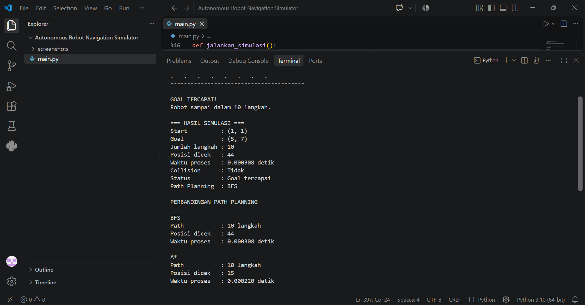

# Autonomous Robot Navigation Simulator

Proyek simulasi navigasi robot menggunakan Python pada arena grid 2D. Robot dapat membaca kondisi di sekitarnya menggunakan sensor virtual, mencari jalur menuju target menggunakan BFS, dan bergerak secara otomatis menghindari obstacle.

## Fitur

* Arena grid 2D dengan posisi awal, target, dan obstacle
* Sensor virtual untuk membaca kondisi di 4 arah
* Pencarian jalur menggunakan BFS (*Breadth-First Search*)
* Validasi gerakan robot
* Pergerakan robot secara otomatis
* Animasi pergerakan di terminal
* Hasil dan statistik simulasi

## Simbol pada Arena

* `S` = posisi awal robot
* `G` = target
* `#` = obstacle
* `.` = area yang bisa dilewati
* `*` = jalur yang ditemukan

## Cara Kerja

1. Robot mulai dari posisi `S`.
2. Sensor virtual membaca kondisi di sekitar robot.
3. Program mencari jalur dari posisi awal menuju `G` menggunakan BFS.
4. Jalur yang ditemukan digunakan sebagai acuan pergerakan robot.
5. Robot bergerak langkah demi langkah dan memeriksa validitas setiap gerakan.
6. Setelah mencapai target, program menampilkan hasil simulasi.

## Tools

* Python 3
* BFS (*Breadth-First Search*)
* Virtual Sensor
* Path Planning

## Cara Menjalankan

Pastikan Python sudah terinstal, kemudian jalankan:

```bash
python main.py
```
## Pengembangan Selanjutnya

* Menambahkan algoritma A*
* Menambahkan obstacle yang bergerak
* Membuat sensor yang lebih realistis
* Menambahkan visualisasi yang lebih interaktif
* Menghubungkan simulasi dengan robot atau mikrokontroler

## Hasil Simulasi

